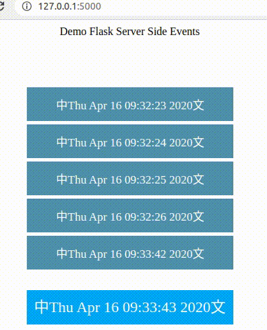

# Demo Flask Server Side Events


# Code
server side:
```python
def get_message():
    """this could be any function that blocks until data is ready"""
    time.sleep(1)
    s = time.ctime(time.time())
    return json.dumps(['中' + s+'文', 'a'], ensure_ascii=False)

@app.route('/stream')
def stream():
    def eventStream():
        while True:
            # wait for source data to be available, then push it
            yield 'data: {}\n\n'.format(get_message())

    return Response(eventStream(), mimetype="text/event-stream")
```

Client side:
```javascript
// handle messages
source.onmessage = function (event) {
    // Do something with the data:
    console.log(event.data);
}
```

# Ref
https://www.smashingmagazine.com/2018/02/sse-websockets-data-flow-http2/